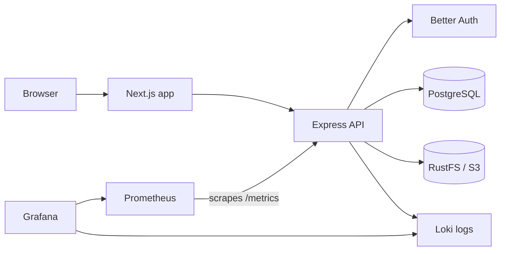

# Full-stack TypeScript boilerplate

A production-oriented pnpm monorepo for building a web product with a public
site, an authenticated application, an API, shared UI and service packages,
end-to-end tests, documentation, and local infrastructure.

The repository is deliberately split into small applications and reusable
libraries. The current example product includes email/password authentication,
item CRUD, document uploads to S3-compatible storage, structured logs,
application metrics, and a local observability stack.

## What is included

| Workspace | Purpose | Local URL |
| --- | --- | --- |
| `@project` | Authenticated Next.js application | <http://localhost:3000> |
| `@project/back` | Express API, authentication, database, and storage | <http://localhost:3010> |
| `@project/landing` | Public Next.js marketing site | <http://localhost:3000> by default |
| `@project/docs` | Docusaurus documentation site | Docusaurus development default |
| `@project/storybook` | Shared component workshop | <http://localhost:6006> |
| `@project/e2e` | Playwright browser test suite | — |

Shared packages live under `libs/`:

- `@project/design-system` — React components, providers, fonts, and styles
- `@project/services` — typed API routes, contracts, and service clients
- `@project/logger` — structured Pino logging with optional Loki delivery
- `@project/analytics` — application event logging and Prometheus counters
- `@project/email` — SMTP and React Email utilities
- `@project/seo` — metadata and JSON-LD helpers
- `@project/typescript-config` — shared TypeScript configuration

## Architecture



The web application uses Server Components and Server Actions to call the API.
The API owns authentication, persistence, object storage, logging, and metrics.
Workspace libraries keep UI components and API contracts consistent across the
applications.

## Prerequisites

- Node.js 20 or newer
- pnpm 11 (the application workspace currently declares pnpm 11.22.0)
- Docker with Docker Compose
- Make, if you want to use the convenience targets

## Quick start

Install dependencies and create the backend configuration:

```sh
pnpm install
cp apps/project-back/.env.example apps/project-back/.env
```

```dotenv
BACK_API_BASE_URL=http://localhost:3010/api
```

Start local infrastructure, initialize RustFS, and apply the database and
authentication migrations:

```sh
make dev-setup
pnpm --filter @project/back db:seed
```

The seed command creates an example item and the default development account:

```text
Email:    demo@example.com
Password: demo@example.com
```

Start the backend and authenticated frontend in separate terminals:

```sh
pnpm --filter @project/back dev
```

```sh
pnpm --filter @project dev
```

Open <http://localhost:3000> and sign in with the seeded account. The API health
endpoint is <http://localhost:3010/api/hello>.

### Without Make

The equivalent core setup is:

```sh
docker compose up -d --wait db redis rustfs mailpit
pnpm docker:rustfs:init
pnpm --filter @project/back db:setup
pnpm --filter @project/back db:seed
```

## Object storage

Document uploads are optional. To enable them locally, choose a bucket name in
the shell or in a root `.env` file before initializing RustFS:

```dotenv
S3_BUCKET=project-documents
```

Run the initializer:

```sh
pnpm docker:rustfs:init
```

It creates the bucket and writes application credentials to
`.rustfs/credentials.env`. Copy the generated `AWS_ACCESS_KEY_ID` and
`AWS_SECRET_ACCESS_KEY` values into `apps/project-back/.env`, then set:

```dotenv
AWS_REGION=us-east-1
S3_BUCKET=project-documents
S3_ENDPOINT=http://127.0.0.1:9000
```

Use `http://rustfs:9000` instead when the backend itself runs inside Docker.
The RustFS API is exposed on port `9000`, and its console is available at
<http://localhost:9001>.

## Common commands

Run commands from the repository root.

| Command | Description |
| --- | --- |
| `make help` | List infrastructure shortcuts |
| `make infra-up` | Start PostgreSQL, Redis, RustFS, and Mailpit |
| `make observability-up` | Start Loki, Prometheus, and Grafana |
| `make down` | Stop the Compose services |
| `make logs` | Follow core infrastructure logs |
| `pnpm check` | Check formatting and code quality with Ultracite |
| `pnpm fix` | Apply safe formatting and lint fixes |
| `pnpm --filter @project/back test` | Run backend Jest tests |
| `pnpm e2e` | Run the Playwright suite |
| `pnpm e2e:ui` | Run Playwright in UI mode |

Useful database commands:

```sh
pnpm --filter @project/back db:migrate
pnpm --filter @project/back auth:migrate
pnpm --filter @project/back db:seed
pnpm --filter @project/back db:rollback
pnpm --filter @project/back db:make <migration-name>
```

`db:reset-schema` deletes the configured database schema and should only be
used when a complete local reset is intended.

## Run the other applications

Only one application can use port `3000` at a time unless you override its
port.

```sh
# Public landing page
pnpm --filter @project/landing dev

# Component workshop
pnpm --filter @project/storybook dev

# Documentation site
pnpm --filter @project/docs start
```

To build a workspace for production, use its package name:

```sh
pnpm --filter @project/back build
pnpm --filter @project build
pnpm --filter @project/landing build
pnpm --filter @project/storybook build
pnpm --filter @project/docs build
```

## End-to-end tests

Install Playwright's Chromium browser once:

```sh
pnpm e2e:install
```

Prepare PostgreSQL, migrations, the seed account, and object storage as
described above, then run:

```sh
pnpm e2e
```

Playwright starts the backend and authenticated frontend automatically. Set
`E2E_SKIP_WEBSERVER=1` to test instances that are already running. Failure
screenshots, videos, traces, and an HTML report are saved under `apps/e2e/`.

## Local services

| Service | Address | Development credentials |
| --- | --- | --- |
| PostgreSQL | `localhost:5432` | `postgres` / `postgres` |
| Redis | `localhost:6379` | None |
| RustFS S3 API | <http://localhost:9000> | Configured by Compose |
| RustFS console | <http://localhost:9001> | `rustfsadmin` / `rustfsadmin` |
| Mailpit | <http://localhost:8025> | None; SMTP on port `1025` |
| Loki | <http://localhost:3100> | None |
| Prometheus | <http://localhost:9090> | None |
| Grafana | <http://localhost:3002> | `admin` / `admin` |

All credentials in this table are local defaults. Replace them and keep
secrets outside source control in shared or production environments.

## Observability

Start the optional logging and metrics stack:

```sh
make observability-up
```

The backend example environment already points the logger at local Loki. Open
Grafana at <http://localhost:3002> and select **Dashboards → Project → Project
observability**. Prometheus scrapes the backend's `/metrics` endpoint, and the
API sends structured logs directly to Loki.

See [docker/observability.md](docker/observability.md) for dashboard queries,
analytics conventions, alerting, and configuration details.

## Repository layout

```text
.
├── apps/                 Deployable applications and test suites
│   ├── project/          Authenticated Next.js frontend
│   ├── project-back/     Express backend
│   ├── landing/          Public Next.js site
│   ├── docs/             Docusaurus documentation
│   ├── storybook/        Component workshop
│   └── e2e/              Playwright tests
├── libs/                 Private reusable workspace packages
├── docker/               Loki, Prometheus, Grafana, and RustFS configuration
├── scripts/              Local setup and maintenance helpers
├── docker-compose.yaml   Development infrastructure
├── Makefile              Infrastructure shortcuts
└── pnpm-workspace.yaml   Workspace and dependency policy
```

Each application and most libraries have a focused README with configuration
and usage details. Start with:

- [Backend guide](apps/project-back/README.md)
- [Authenticated frontend guide](apps/project/README.md)
- [End-to-end testing guide](apps/e2e/README.md)
- [Design system guide](libs/design-system/README.md)
- [Services guide](libs/services/README.md)
- [Logger guide](libs/logger/README.md)

## Configuration notes

- Environment variables are loaded by the application that consumes them.
- Keep real secrets in untracked `.env` files or a secret manager.
- The frontend's `BACK_API_BASE_URL` is server-side and should not use a
  `NEXT_PUBLIC_` prefix.
- The backend validates its environment at startup; production deployments
  must explicitly provide the required host, port, database, and auth values.
- Change local default passwords before exposing any service beyond your own
  machine.

## License

MIT
